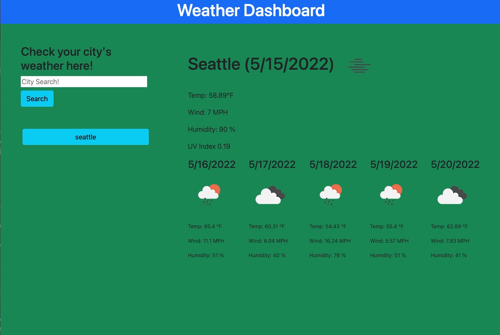

# weather-dashboard

## With this project I was tasked with using third-party APIs to allow users to access their data. In this task I am going to create a weather dashboard that uses dynamically updated HTML and CSS.

### The weather dashboard will include the following:

1. Users will search for a city and then be returned the current and future conditions for that city.

2. The city will then be added to a search history.

3. The current conditions for that city will include city name, the date, an icon that represents the weather
   conditions, the temperature, humidity, wind speed, and the UV index.

4. The future conditions will display the date, an icon that represents the weather conditions, the temperature, the
   wind speed, and the humidity.

5. When the user clicks on a city in the search history then they will again be presented with the current and future
   conditions for that city.

[GitHub pages](https://cefaust.github.io/weather-dashboard/)